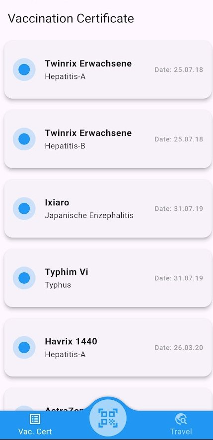

# VacciScan

VacciScan is a Flutter app that uses GPT-4-turbo to scan and extract vaccine details from certificates. It processes images, retrieves relevant data, and stores it securely.



## Features

- **Scan & Extract**: Capture or upload certificate images, extract vaccine details.
- **Local & Cloud Storage**: Save data locally or sync with Firebase.

## Installation

1. Clone the repo and install dependencies:
   ```bash
   git clone https://github.com/philipprobin/vacciscan.git
   cd VacciScan
   flutter pub get

## Features

- **Scan & Extract**: Capture or upload certificate images, extract vaccine details.
- **Local & Cloud Storage**: Save data locally or sync with Firebase.

## Usage

  Scan a certificate, extract data, and manage your vaccination records.